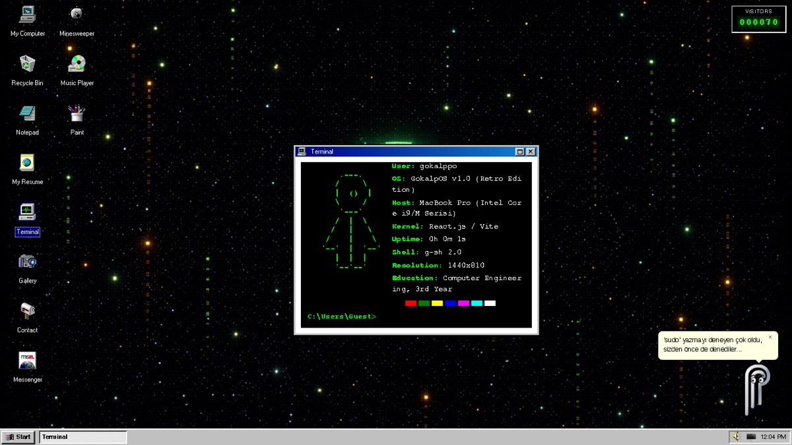
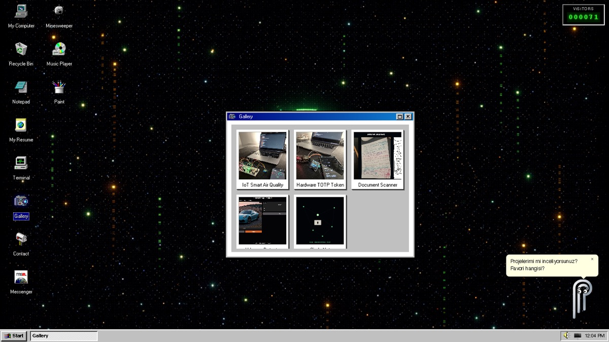
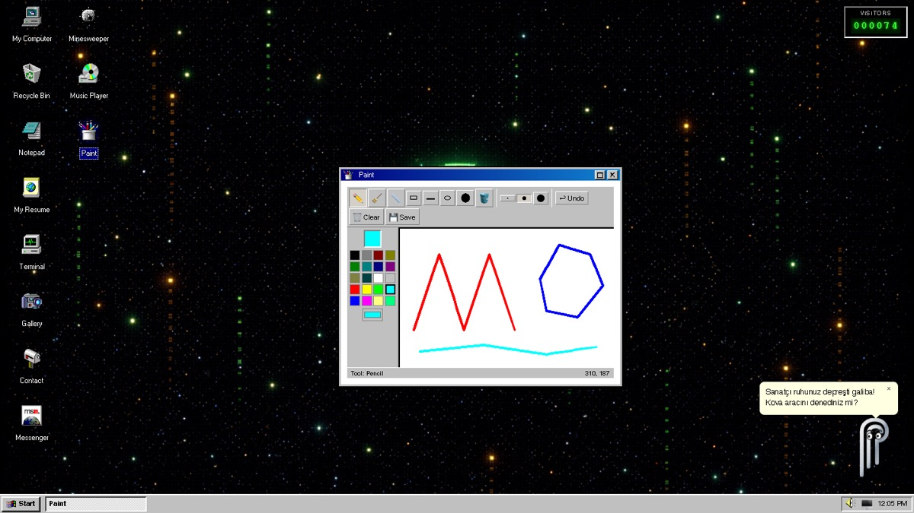
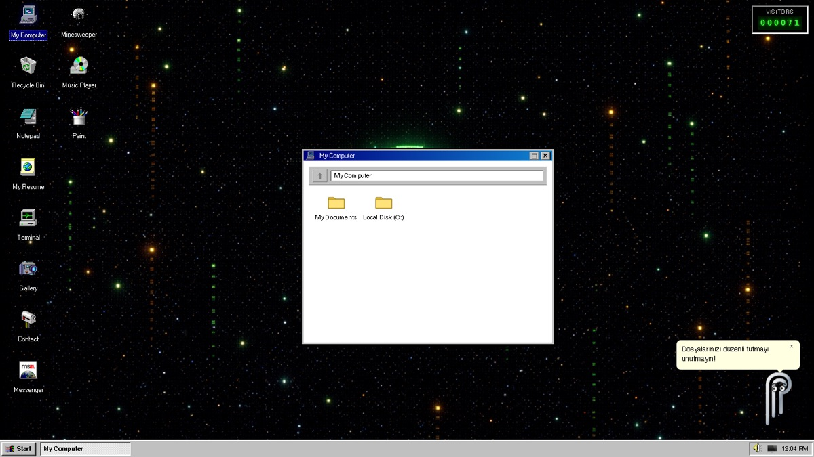

# gokalppoOS

> A fully interactive Windows 98 desktop that doubles as my developer portfolio.
> Boot it, double-click around, open a terminal, draw in Paint, chat in a real-time Messenger.

**Live:** [gokalppo.me](https://gokalppo.me)



## What is this?

Instead of a static page of cards, my portfolio is a tiny operating system running in the browser. You get a BIOS boot screen, a desktop with draggable icons, a Start menu and taskbar, and overlapping windows you can move, maximize, and close. The portfolio content (resume, projects, contact) lives inside the apps, and everything else is there because building it was fun and a good way to practice real front-end and real-time engineering.

## Features

### The OS shell
- **BIOS boot sequence**, Windows 98 startup and shutdown sounds, taskbar with a live clock and volume control
- **Window manager**: drag, resize from all eight edges and corners, minimize (the window flies to its taskbar button), maximize, open/close transitions (reduced-motion aware), focus and z-order handling, dimmed inactive title bars
- **Start menu**: Programs (every app), Settings (Display Properties, System Properties), Documents, Help, **Run...** (type a program name like `paint` or `cmd`, a web address, or any Terminal command such as `neofetch`) and Shut Down. Fully keyboard-navigable
- **Display Properties**: four wallpapers (including Windows 98 and Bliss) or a solid colour, five colour schemes (Windows Standard, Rainy Day, Hotdog Stand, Eggplant, Desert), and a screen saver picker (Starfield, Mystify or none) with a wait time and live preview. Saved in `localStorage`
- **Taskbar**: click a button to minimize or restore, a Show Desktop button, a clock that opens a calendar, and tray icons for network status, live visitor count and volume
- **Alt + `** (and Alt+Tab where the browser lets it through) opens a Win98-style window switcher; release Alt to jump, Esc to cancel
- **Optional system sounds** (synthesized with Web Audio, off by default): open, close, minimize, restore, error. Toggle them from the volume popup
- **Desktop icons** you can drag, multi-select with a selection box, and rearrange. Positions persist in `localStorage`, and right-click > **Arrange Icons** animates them back to their defaults
- **Virtual file system** shared by My Computer, the Recycle Bin, and Notepad: create folders and files, rename, delete to the bin, restore, or delete permanently. Stored in `localStorage`
- **Clippy-style assistant** that gives context-aware tips depending on which app you have focused (and follows your cursor with its eyes)
- **Warp-speed screensaver** after two minutes of inactivity
- **Crash-proof windows**: each app runs inside an error boundary, so a crashing program shows a Win98-style "illegal operation" dialog instead of taking the desktop down (hidden `crash` terminal command to see it)
- **Accessibility**: desktop icons are keyboard-focusable buttons (Enter/Space opens), windows are labelled dialogs that take focus when opened, taskbar/tray controls are real buttons with labels, Escape closes menus and popups, focus rings are visible, and `prefers-reduced-motion` turns off screen savers and decorative animation
- **Hidden easter egg**: try the Konami Code
- **Turkish / English**: a TR/EN switch in the tray (follows the browser language by default). The shell, Clippy, Terminal, Gallery, Contact, Guestbook, Internet Explorer, Solitaire, Minesweeper and System Properties are translated; program names stay as proper names

### Apps
| App | What it does |
| --- | --- |
| **My Resume** | Embedded PDF resume |
| **Gallery** | Project showcase with tech-stack badges |
| **Terminal** | A small shell wired into the OS: `cd`, `ls`, `pwd`, `tree`, `cat`, `mkdir`, `touch`, `cp`, `mv`, `rm` work on the same files as My Computer (`rm` sends to the Recycle Bin, `echo hi > a.txt` and `ls >> list.txt` redirect). `start`/`open`, `notepad file.txt`, `paint pic.png` launch programs, `apps` lists them, `tasklist`/`kill` manage open windows. Plus `help`, `about`, `projects`, `github`, `linkedin`, `resume`, `contact`, `neofetch`, `matrix`, `date`, `clear` |
| **Messenger** | MSN-style real-time chat (details below) |
| **Notepad** | Text editor with working Edit and Search menus: Undo/Cut/Copy/Paste, Select All, Time/Date (F5), Word Wrap, and **Find (Ctrl+F), Find Next (F3) and Replace (Ctrl+H)** with match case, a live match count and Replace All. Opens and saves `.txt` files in My Documents (saving under an existing name replaces it) |
| **Paint** | Pencil, eraser, line, rectangle and ellipse (outlined or filled), bucket fill, **text tool** (font, size, bold, multi-line), color palette and undo. **File > Save / Save As / Open** keep pictures in My Documents (they reopen from My Computer), plus a PNG download |
| **Minesweeper** | The classic, with flags, a timer and a global **Best Times** board (Firebase) |
| **Solitaire** | Klondike (draw-one): drag and drop or click-to-move, double-click to send a card to its foundation, undo, timer and move counter |
| **Internet Explorer** | A tiny browser with an address bar, history, a Favorites menu and internal pages (home, about, every project, links). Real sites open in a new tab |
| **Guestbook** | Visitors leave a message that stays on the site (Firebase), with validation, a posting cooldown and a honeypot against bots |
| **Music Player** | Playlist player |
| **My Computer / Recycle Bin** | File Explorer over the virtual file system; pictures show thumbnails and open in Paint, text files open in Notepad. The virtual disk lives in `localStorage` (about 3.5 MB are used before it politely refuses to save more) |
| **Contact** | Contact card with copy-to-clipboard email |
| **System Properties** | Win98 "System Properties" dialog (Start menu): a General tab and a Device Manager tree listing the technologies from my projects and where each one is used |
| **Visitor counter** | Real, atomic counter stored in Firebase |

### Messenger (the big one)
- Email/password accounts via Firebase Authentication
- Global chat rooms and **private one-to-one chats**
- Friend requests (send, accept, decline) with unread-message badges
- Online / away / busy / offline presence, with automatic *away* after inactivity and `onDisconnect` cleanup
- **Nudge** (shakes the other person's window), notification sounds
- **Live typing indicator** ("... is typing") in private chats
- **Gökalp Bot**: a rule-based assistant (English and Turkish) that answers questions about the projects, skills, resume and contact details. It is pinned in the contact list and also available **without signing in** from the login screen; it runs in the browser, so it costs nothing
- **Guest sign-in** (Firebase anonymous auth) for visitors who don't want to create an account. Guests can chat but cannot send friend requests; that is enforced in the database rules too, and the UI asks them to sign in
- Message history loads in pages of 50 with a "Load older messages" button
- **Read receipts** in private chats: ✓ sent, ✓✓ read (stored as per-friend `lastReadAt` stamps, never in someone else's data)
- Admin role with message moderation and user bans, enforced in the database rules, not just the UI

## Tech stack

- **React 19** + **Vite 7**
- **Firebase** Authentication and Realtime Database
- **react-draggable** for window and icon dragging
- **EmailJS** for the contact form
- Hosted on **Netlify**, deployed automatically from `main`

## Architecture

```
src/
├── App.jsx                  # Boot flow, window state, focus/z-index, global overlays
├── firebase.js              # Firebase app, auth and database instances
├── context/
│   ├── OSContext.jsx        # Volume and the close-window event bridge
│   └── FileSystemContext.jsx# localStorage-backed virtual file system
└── components/
    ├── Desktop.jsx          # Icons, selection, context menu, window rendering
    ├── Window.jsx           # Draggable / maximizable window chrome
    ├── Taskbar.jsx, StartMenu.jsx
    ├── BootScreen.jsx, BSOD.jsx, ScreenSaver.jsx, Clippy.jsx, VisitorCounter.jsx
    └── apps/                # Terminal, Paint, Notepad, FileExplorer, Gallery, Minesweeper, ...
        └── messenger/       # Login, container and the chat interface
```

A few design decisions worth mentioning:

- **Code splitting.** Every app is loaded with `React.lazy`, and the Firebase SDK is deferred until it is needed. The initial JavaScript bundle went from ~582 KB to ~271 KB, and each app (2-30 KB) is fetched the first time you open it.
- **State kept out of stale closures.** Rapid-fire interactions (double-clicks, fast window focus changes, multi-icon drags) read from refs that are updated synchronously next to React state, which fixed several race conditions with `z-index` and drag selection.
- **Tested where it matters.** Vitest covers the virtual file system, the Terminal command parser, the Messenger helpers, and the whole chat UI against an in-memory Firebase fake (send/censor, private rooms and unread counts, typing, friend requests, admin delete/ban, the ban kill-switch).
- **Messenger is split into small pieces.** `ChatInterface` is a thin orchestrator over focused hooks (`usePresence`, `useMessages`, `useTypingIndicator`, `useNudge`, `useFriendActions`, `useAdminTools`, ...) and presentational components, with pure logic in `chatUtils.js`.
- **Guest sign-in** needs the *Anonymous* provider enabled in Firebase Console > Authentication > Sign-in method; without it the button explains that guest sign-in is unavailable.
- **Privacy-friendly analytics.** The only analytics are anonymous app-open counters (`analytics/appOpens/{app}`): no cookies, no IDs, no personal data. Do Not Track is respected, local development is excluded, and only an admin can read the totals (Messenger > Admin Tools).
- **Security lives in the database rules.** The client is never trusted: `role` and `isBanned` can only be changed by admins, private messages and typing state are readable only by the two participants, friend lists cannot be forged, and email addresses are kept in a separate `userPrivate` node. Rules are in [`database.rules.json`](database.rules.json).

## Hardening

- **Database rules** (`database.rules.json`) are covered by an emulator test suite (`npm run test:rules`, 46 tests). Chat messages need a server timestamp and are limited to about one per second per person (the sender's `lastMessageAt` has to be stamped in the same atomic write); they also validate message length, the shape and size of `outbox` entries, guestbook posts and Minesweeper records; roles and bans can only be changed by admins.
- **Visitor counter** increments once per browser session, so reloads cannot inflate it (each write is also limited to +1 by the rules).
- **Firebase App Check (optional).** Set `VITE_RECAPTCHA_SITE_KEY` (see `.env.example`) to a reCAPTCHA v3 site key, register the same key in Firebase Console > App Check, deploy, and only then turn enforcement on. Without the key the code is compiled out, so the repo works as-is.
- **EmailJS**: restrict the allowed domain and set a monthly limit in the EmailJS dashboard; the public key in the client is not a secret.

## Running it locally

Requires Node.js 18+.

```bash
git clone https://github.com/gokalppo/gokalppoOS.git
cd gokalppoOS
npm install
npm run dev
```

Open <http://localhost:5173>, wait for the BIOS text, and press **Enter**.

| Script | Purpose |
| --- | --- |
| `npm run dev` | Start the Vite dev server |
| `npm run build` | Production build into `dist/` |
| `npm run preview` | Serve the production build locally |
| `npm test` | Run the Vitest suite (420+ tests) |
| `npm run test:rules` | Run the security-rules tests against the Firebase Realtime Database emulator (needs Java; starts the emulator itself) |
| `npm run lint` | Run ESLint |

### Using your own Firebase project

The app talks to my Firebase project by default. The Firebase web config in [`src/firebase.js`](src/firebase.js) is public by design (it only identifies the project; access is controlled by the security rules). To run your own backend:

1. Create a Firebase project and enable **Authentication** (Email/Password) and **Realtime Database**.
2. Replace the config object in `src/firebase.js`.
3. Publish the rules from `database.rules.json` in the Realtime Database console.
4. Set up your own EmailJS keys in `src/components/apps/OutlookExpress.jsx` if you want the contact form to send mail.

## Screenshots

| | |
| --- | --- |
|  |  |
|  |  |

## Roadmap

- Mobile / touch-friendly layout
- Welcome window
- A blog section in Internet Explorer
- Keyboard navigation and screen reader support

## Author

**Gokalp Eker**, computer engineering student.
[GitHub](https://github.com/gokalppo) · [LinkedIn](https://www.linkedin.com/in/gokalp-eker/) · [gokalppo.me](https://gokalppo.me)
